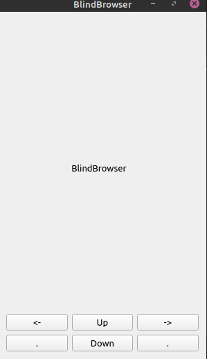

# blindbrowser

## Назначение
 Демонстрация работы браузера на телефонах, использующих шрифт Брайля.

## TODO
- **Написать интерфейс на С++**
- **Написать виджеты интерфейса браузера(Button, Link, Input)**
- **Написать модуль работы с V8 или отказаться от него и компилировать JS при помощи утилит**
- **Определять зловредные скрипты на JS (VirusTotal); Менять права при исполнении скриптов или найти другой способ снизить риски**
- **Конвертировать CSS координаты и плэсинги в координаты браузера**
- **Выявлять жизненноважные скрипты для работы сайта (Скачивание и прокрутка)**

## Prototype

